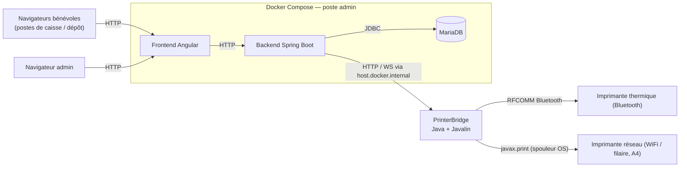
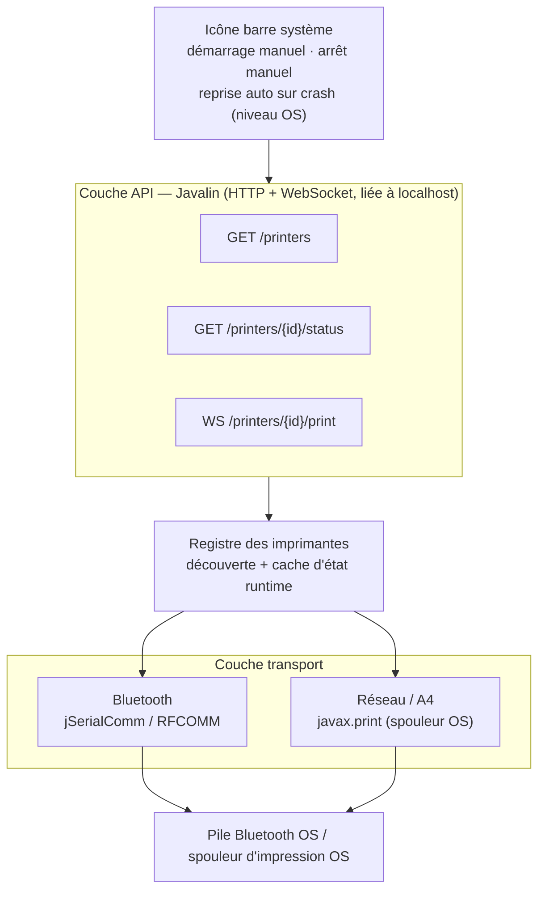

# CLAUDE.md — PrinterBridge

## Présentation

PrinterBridge est un petit service natif, installé sur le poste de l'admin d'une association utilisant **PluriBourse** (plateforme de gestion de bourses aux jouets/vêtements, dépôt `PluriBourse` — repo séparé). Son rôle : posséder seul l'accès aux imprimantes physiques (Bluetooth, WiFi, filaire) et les exposer via une petite API locale, pour que le backend de PluriBourse n'ait plus jamais à parler directement au matériel.

Ce document résume les décisions et pistes issues d'une session de conception avec l'utilisateur (juillet 2026) — c'est un **point de départ pour cadrer le travail**, pas une spec figée. Beaucoup de détails restent à trancher (voir § Points ouverts).

## Pourquoi ce projet existe

PluriBourse tourne en **Docker Compose** sur le poste de l'admin (backend Spring Boot + frontend Angular + MariaDB, dans des conteneurs). Deux problèmes structurels en ont découlé :

1. **Le Bluetooth n'est pas accessible depuis un conteneur.** Les imprimantes thermiques utilisées pour les étiquettes de dépôt se connectent en **Bluetooth RFCOMM (profil SPP)** — un périphérique matériel de la machine hôte, pas une ressource réseau. Un conteneur Docker n'y a par défaut aucun accès, y compris sous Docker natif Linux (la cible principale des associations — voir § Positionnement) : le passthrough Bluetooth vers un conteneur reste non trivial (permissions, règles udev), même si techniquement moins bloqué que sous Docker Desktop Windows/Mac.
2. **Une imprimante Bluetooth n'accepte qu'une connexion active à la fois** (contrainte du protocole SPP, pas de l'implémentation). Pour qu'elle soit partagée entre plusieurs postes de caisse/dépôt, il faut qu'**un seul processus** détienne la connexion physique et serve les autres postes par-dessus — d'où l'intérêt d'un point central.

PrinterBridge est ce point central : un processus natif (donc avec accès plein au matériel de l'hôte), qui tourne à côté du conteneur backend, et que le backend interroge via HTTP/WebSocket au lieu d'ouvrir lui-même des sockets/ports série.

Les imprimantes réseau (WiFi/filaire, type A4) n'ont pas ce problème d'accès matériel — un conteneur Docker les joint très bien via son réseau bridge par défaut. Elles passent quand même par PrinterBridge pour centraliser la logique de découverte/statut au même endroit, et parce qu'une association peut aussi rencontrer des soucis de segmentation réseau (VLAN d'entreprise, etc.) indépendants de Docker.

## Ce qui a été écarté, et pourquoi

- **`javax.print` côté backend** — ne fonctionnerait que si le backend tournait nativement sur une machine avec les imprimantes déjà installées au niveau OS ; inutilisable depuis un conteneur Docker minimal (pas de CUPS/spouleur configuré dedans). Ce rejet ne concerne que l'exécution **dans le conteneur** — PrinterBridge, qui tourne nativement sur l'hôte, utilise justement `javax.print` pour les imprimantes réseau/A4 (voir § Stack technique retenue).
- **QZ Tray** (agent d'impression open source existant, https://qz.io) — sérieusement envisagé, c'est un outil mature qui fait déjà à peu près ce rôle (Serial/USB/Socket, ESC/POS, API WebSocket locale/distante). Écarté au profit d'un développement maison pour garder le contrôle total du contrat d'API et éviter une dépendance externe — **à rediscuter si le scope de PrinterBridge grossit trop** (ex. support USB/HID, imprimantes exotiques).
- **Sortir tout le backend de Docker** — réglerait aussi le problème Bluetooth, mais casserait la simplicité d'installation (`docker compose up`) documentée pour un public non technique. Écarté pour l'instant ; reste une option si PrinterBridge s'avère trop complexe à maintenir.
- **Faire relancer PrinterBridge par le backend en cas de crash** — impossible proprement : le backend tourne dans un conteneur isolé du système hôte, il n'a aucun moyen sain de lancer un processus natif sur la machine hôte (sans donner au conteneur des privilèges larges, ce qui casserait l'isolation qu'on cherche à garder).

## Positionnement et hypothèses de déploiement (v1)

- **Correction (juillet 2026, après-coup)** : la cible principale du poste admin est en réalité **Linux (Debian/Ubuntu, x86_64 — poste de bureau, ex. avec KDE)**, pas Docker Desktop Windows/Mac comme supposé initialement dans la session de conception. Une cible secondaire Raspberry Pi/Raspbian (arm64/armhf) est aussi envisagée, à supporter mais moins prioritaire. Les sections ci-dessus mentionnant Windows/Mac comme cible principale restent affichées telles quelles (traces de la session initiale) mais sont **obsolètes sur ce point précis** — se fier à cette section pour la réalité du déploiement.
- PrinterBridge tourne sur **la même machine physique** que le backend Dockerisé de PluriBourse, pour l'instant. Pas encore pensé pour un scénario multi-machines.
- Le backend (dans son conteneur) joint PrinterBridge en HTTP via `host.docker.internal`. Sur la cible principale (Docker natif Linux), ça **nécessite** `extra_hosts: - "host.docker.internal:host-gateway"` côté `docker-compose.yml` de PluriBourse — ce n'est plus un cas secondaire, c'est la configuration standard attendue. Windows/Mac Docker Desktop (si jamais rencontré chez une association) l'a nativement, sans configuration supplémentaire.
- **Lancement manuel par l'admin**, pas de démarrage automatique à l'ouverture de session/boot — choix produit assumé (préférence explicite de l'utilisateur : les applis qui tournent en arrière-plan au démarrage consomment des ressources pour rien). Une icône en barre système est prévue pour que l'admin voie que ça tourne — **implémentée** (`TrayIconSupport`, dans `Main`) : icône dessinée en code (pas de fichier image), menu "Quitter" qui arrête proprement Javalin puis sort avec le code 0 (sortie volontaire, ne doit pas déclencher `Restart=on-failure` côté systemd). Dégrade proprement si `SystemTray` n'est pas supporté (log un avertissement, continue sans icône) — pertinent pour l'exécution en environnement headless. **Correctif (audit juillet 2026)** : un hook d'arrêt JVM (`Runtime.addShutdownHook`) déclenche la même logique d'arrêt propre sur un `SIGTERM` (ex. `systemctl --user stop`), pas seulement via le "Quitter" du tray — sans ça, un arrêt supervisé tuait la JVM sans laisser Jetty/les écritures Bluetooth en cours se terminer proprement. Idempotent avec le "Quitter" du tray (un `AtomicBoolean` évite un double arrêt si les deux chemins se déclenchent).
- **Reprise automatique en cas de plantage, oui, mais sans contredire le point précédent** — la formulation initiale ("mécanisme natif de l'OS... pas de code applicatif custom") laissait penser à un service qui démarre tout seul, ce qui n'est pas le cas : "démarrage automatique au boot" et "reprise automatique après un crash pendant que ça tourne" sont deux réglages indépendants. Résolu pour Linux via une unité `systemd --user` (`Restart=on-failure`) installée par le `.deb` mais **jamais activée/démarrée automatiquement** — l'admin la démarre explicitement (`systemctl --user start printerbridge`), et si elle crashe *après ça*, systemd la relance sans action de l'admin ; un arrêt volontaire (sortie propre, code 0), lui, ne déclenche aucun redémarrage. Détails d'implémentation et procédure de test : `packaging/README.md` et `packaging/linux/TESTING.md` (non validé sur machine réelle). Équivalent Windows (Service Recovery) / macOS (`launchd KeepAlive`) pas encore fait — cf. Points ouverts.
- Le backend PluriBourse doit dans tous les cas détecter et **afficher clairement** quand PrinterBridge est injoignable (message visible, pas un badge discret) — c'est le vrai filet de sécurité, peu importe les choix ci-dessus.
- **Signature de code** — pas de certificat en v1 pilote ; avertissements SmartScreen/Gatekeeper assumés, à documenter pour l'admin (procédure "exécuter quand même").

## Stack technique retenue

- **Java**, empaqueté avec **`jpackage`** — génère un installeur natif par OS (**.deb Linux/Debian/Ubuntu — cible principale**, .msi Windows, .pkg Mac, ces deux derniers secondaires) qui embarque son propre runtime minimal. `jpackage` invoque `jlink` en interne (pas d'invocation manuelle) pour construire ce runtime par analyse `jdeps` de l'app. **Aucun JDK à installer côté admin.** Voir § Décisions prises (paquetage multi-OS) pour le pipeline Maven qui prépare l'entrée de `jpackage`.
- **Javalin** comme framework HTTP/WebSocket — un microframework (une seule dépendance obligatoire, Jetty embarqué), beaucoup plus léger que Spring Boot pour ce besoin (2-3 endpoints). Nécessite Java 17+.
- **jSerialComm** pour l'accès Bluetooth (RFCOMM) — la même bibliothèque déjà utilisée côté backend PluriBourse (`SerialPort.getCommPorts()` / `getCommPort(...).openPort()`), donc du code et un savoir-faire directement réutilisables.
- **`javax.print`** (API Java standard) pour la découverte *et* l'impression des imprimantes réseau/A4 — interroge et pilote le spouleur déjà configuré au niveau OS (spouleur Windows, CUPS sur Mac/Linux). L'admin ajoute l'imprimante via les réglages OS habituels ; PrinterBridge liste ce que l'OS connaît déjà (`PrintServiceLookup`) et soumet les jobs via `DocPrintJob`, sans gérer lui-même de socket ni de port 9100 — le driver du fabricant s'occupe de la livraison réseau/USB/VLAN.
  ⚠️ **Limite constatée en pratique (test sur machine réelle)** : le spouleur Windows ne supporte **aucun** flavor PDF natif (`DocFlavor.INPUT_STREAM.PDF` non supporté par les 3 imprimantes testées, y compris "Microsoft Print to PDF") — contrairement à CUPS (Mac/Linux), nativement centré PDF. Seuls les flavors image (GIF/JPEG/PNG), `Pageable`/`Printable` (pipeline Java2D) et `application/octet-stream` générique sont supportés côté Windows. **`Apache PDFBox`** est donc utilisé pour rendre chaque page du PDF reçu en image, encapsulée dans un `java.awt.print.Printable`, soumis via `DocFlavor.SERVICE_FORMATTED.PRINTABLE` — ce flavor-là est supporté partout. Reste dans l'esprit de la décision initiale (tout via `javax.print`), avec ce détour de rendu ajouté.
  **Correctifs (audit juillet 2026, `PdfPrintable`)** : (1) l'échelle de rendu ne considérait que le ratio de largeur, pas la hauteur — une page dont le ratio d'aspect diffère du format A4 pouvait déborder verticalement de la zone imprimable ou être tronquée ; corrigé en prenant le plus petit des deux ratios (largeur/hauteur), qui préserve les proportions et garantit que l'image rendue tient toujours dans la zone imprimable. (2) `MAX_PAGE_DIMENSION_POINTS` bornait la taille d'une page mais pas leur nombre — un PDF de quelques Ko avec des milliers de pages minuscules passait la limite de 25 Mo du WS tout en forçant des milliers de rendus 300 DPI ; ajout de `MAX_PAGE_COUNT` (500) rejetant explicitement un document au-delà. (3) une `mediaBox` de largeur/hauteur nulle ou négative aurait produit une échelle `Infinity`/`NaN` silencieuse ; désormais rejetée explicitement avant le rendu.

## Architecture logicielle

### Vue d'ensemble (contexte système)

### Architecture interne de PrinterBridge

### Responsabilités par couche

- **Registre / découverte** — énumère les ports Bluetooth appairés (`jSerialComm.getCommPorts()`) et les imprimantes réseau/A4 déjà installées au niveau OS (`javax.print.PrintServiceLookup`). Pas de scan actif dans les deux cas : l'admin appaire/ajoute l'imprimante via les réglages OS habituels, PrinterBridge se contente de lister ce qui existe déjà.
- **Identifiants stables** — chaque imprimante reçoit un id déterministe (hash) dérivé de son adresse physique : hash du nom du `PrintService` OS pour le réseau/A4 ; pour le Bluetooth, basé sur la MAC quand elle est connue (`BluetoothPrinterDiscovery.physicalKey`, correctif audit juillet 2026 — voir § Décisions prises (implémentation)), avec repli sur le nom de port système sinon. La MAC a été demandée explicitement car elle ne change jamais, contrairement à un port COM/rfcomm qui peut être réattribué au même appareil réappairé. Recalculé au démarrage, pas de fichier d'état à persister. PluriBourse ne connaît que cet id, jamais l'adresse physique.
- **Transport Bluetooth** — ouvre/écrit sur le port RFCOMM. Une seule connexion active à la fois par imprimante (contrainte du protocole).
- **Transport réseau / A4** — délègue au spouleur d'impression de l'OS via `javax.print` (`PrintServiceLookup` pour la découverte, `DocPrintJob` pour l'envoi) ; le driver du fabricant gère la livraison réseau/USB/VLAN à la place de PrinterBridge.
- **Couche API** — HTTP + WebSocket, **liée à `localhost` uniquement**, jamais exposée publiquement (elle accepte des jobs d'impression, donc surface sensible). Le binding loopback seul ne suffit pas : `127.0.0.1` est partagé par tous les processus/onglets navigateur de la machine, pas seulement le backend PluriBourse. `ApiServer.enforceSameOrigin` rejette (403) toute requête HTTP ou tentative de handshake WebSocket portant un en-tête `Origin` qui ne correspond pas à l'origine propre du serveur (`http://127.0.0.1:<port>`) — une requête sans `Origin` (cas du backend PluriBourse, client HTTP/WS non-navigateur) reste autorisée. Corrige un trou identifié par audit (juillet 2026) : sans ça, un onglet malveillant ouvert sur le poste admin pouvait déclencher une vraie impression via `POST /printers/{id}/test-print` ou lire/écrire via `WS /printers/{id}/print`.

## API exposée au backend PluriBourse (provisoire)

| Méthode | Chemin | Rôle |
|---|---|---|
| `GET` | `/printers` | Liste des imprimantes découvertes + statut courant — alimente le formulaire admin de PluriBourse (fin de la saisie manuelle IP/port). |
| `GET` | `/printers/{id}/status` | Test de connectivité à la demande. |
| `POST` | `/printers/{id}/test-print` | Envoie un petit payload de test généré (ESC/POS ou PDF selon le transport) et rend compte du succès/échec réel — pas juste que le port/service peut être ouvert. |
| `WS` | `/printers/{id}/print` | Envoi du contenu à imprimer (bytes ESC/POS pour le thermique, PDF pour l'A4). |

**Tranché :** l'enveloppe de `WS /printers/{id}/print` est un petit message JSON de contrôle (type de contenu, taille) suivi d'une frame binaire brute portant le payload (bytes ESC/POS ou PDF). Identifiants stables : voir § Responsabilités par couche (id dérivé de l'adresse physique, pas de nom choisi par l'admin côté PrinterBridge). **Correctif (audit juillet 2026)** : la frame binaire est bornée à 25 Mo (`ApiServer.MAX_PRINT_PAYLOAD_BYTES`) — le défaut Jetty de 64 Ko était trop bas pour un vrai PDF A4.

**Tranché (partiellement) :** un id de printer inconnu remonte systématiquement en 404 (`UnknownPrinterException`), cohérent entre `GET /printers/{id}/status`, `POST /printers/{id}/test-print` et `WS /printers/{id}/print`. **Reste non tranché :** gestion des autres erreurs/timeouts (imprimante occupée, lien mort, échec matériel) remontées au backend.

## Ce que ça change côté PluriBourse (repo séparé)

Pour référence — ce travail n'est **pas** dans ce repo, mais dans `PluriBourse` :

- `Printer` (entité JPA) et sa migration — repenser ce qu'on stocke : aujourd'hui `host`/`port` (A4) ou `serialPort`/`widthMm` (THERMAL) correspondent à un accès direct ; avec PrinterBridge, PluriBourse n'a plus besoin de connaître l'adresse physique, juste un identifiant stable côté PrinterBridge.
- `PrinterConnectivityChecker` (interface + impls `NetworkPrinterConnectivityChecker`/`SerialPrinterConnectivityChecker`) — remplacées par un client HTTP vers `GET /printers/{id}/status`.
- `ThermalPrintService`/`DocumentPrintService` — au lieu d'écrire directement sur `Socket`/`SerialPort`, envoient le contenu via `WS /printers/{id}/print`. C'est aussi l'occasion de découpler le **format de contenu** (ESC/POS vs PDF) du **transport** — aujourd'hui couplés en dur par le type d'imprimante (`PrinterType.THERMAL`/`A4`), alors qu'avec PrinterBridge n'importe quel format pourrait voyager sur n'importe quel transport (ex. imprimante thermique WiFi, pas supportée aujourd'hui).
- `docker-compose.yml` de PluriBourse — ajout de `extra_hosts` pour la compatibilité Linux.
- Frontend (`printer-form.component.ts`) — remplace la saisie manuelle host/port par une liste issue de `GET /printers`.

Cette conversation de conception a aussi produit un schéma visuel (artefact Claude) — non repris ici car privé/éphémère ; ce document en est la version texte durable.

## Décisions prises (implémentation découverte réseau/A4 et Bluetooth)

- **Spike jSerialComm confirmé** — l'API `jSerialComm` elle-même ne donne accès à aucune adresse MAC Bluetooth ni identifiant matériel stable pour un port SPP (seulement `getSerialNumber()`/VID/PID pour de l'USB, inapplicable au Bluetooth). La MAC reste toutefois accessible par un autre chemin : `WindowsBluetoothPortInfo.parsePortInfo` (WMI, `MAC_BEFORE_SUFFIX`) et `LinuxBluetoothPortInfo` (`rfcomm show`, `parseRfcommBindings`) l'extraient déjà toutes les deux — jusqu'ici uniquement pour résoudre le nom convivial, jamais remontée jusqu'à l'id.
- **Correctif (audit juillet 2026) — id Bluetooth basé sur la MAC** : une MAC avait été explicitement demandée pour l'id (elle ne change jamais, contrairement à un port COM/rfcomm réattribuable au même appareil réappairé), mais l'id utilisait encore `getSystemPortName()` (ex. `COM7`) en pratique. Corrigé : `BluetoothPrinterDiscovery.physicalKey` préfère désormais la MAC — celle exposée par `WindowsBluetoothPortInfo.PortInfo.mac()` (Windows, ajoutée au record) ou par `LinuxBluetoothPortInfo.queryMacAddresses()` (Linux, nouvelle méthode partageant le même appel `rfcomm show`/`bluetoothctl` que la résolution du nom convivial) — et ne retombe sur le nom de port que si aucune MAC n'est connue pour ce port (requête échouée, appareil inconnu de WMI/rfcomm, autre OS). Les deux formats de MAC (Windows : 12 hex sans séparateur ; Linux : séparée par `:`) sont normalisés avant hash pour qu'une même adresse physique produise toujours le même id, quel que soit l'OS qui l'a résolue. Testé via `BluetoothPrinterDiscoveryTest` (construction directe de `physicalKey` avec des maps fabriquées, indépendamment de tout matériel réel) ; non revalidé contre du matériel réel (cf. limite déjà connue de la découverte Bluetooth).
  **Correctif (27 juillet 2026) — cassait la CI Linux/Mac** : la première version de `physicalKey` prenait un vrai `SerialPort` en paramètre, et les tests le construisaient via `SerialPort.getCommPort("COM7")` (ou `"rfcomm0"`) — sauf que `getCommPort(String)` valide son argument contre la convention de nommage de l'OS courant et rejette (`SerialPortInvalidPortException`) un descripteur Windows sur Linux/Mac et inversement, ce que la CI a repéré immédiatement sur les runners `ubuntu-latest`/`macos-latest` (jamais vu en local, développé sur Windows). Corrigé en faisant prendre à `physicalKey` un simple nom de port (`String`) plutôt qu'un `SerialPort` — c'est tout ce dont il se sert (`port.getSystemPortName()` côté appelant) — ce qui rend les tests indépendants de tout objet `SerialPort`, donc de toute validation spécifique à l'OS.
- **`jSerialComm.getCommPorts()` n'a aucun moyen fiable de distinguer un port Bluetooth SPP d'un autre port série (USB, UART physique)** — la découverte Bluetooth actuelle liste donc tous les ports COM détectés comme candidats thermiques. À affiner une fois testé contre une vraie imprimante thermique appairée (aucun matériel Bluetooth disponible pour valider un filtre pour l'instant) — **résolu pour Windows, voir décision de validation manuelle ci-dessous ; toujours ouvert pour Linux/macOS**.
- **Validation manuelle de bout en bout sur Windows (24 juillet 2026)** — testé avec l'application réelle (pas seulement `mvn test`) sur cette machine : impression fonctionnelle confirmée sur les deux transports, une imprimante Bluetooth thermique appairée (`WS /printers/{id}/print` en ESC/POS) et une imprimante réseau/A4 (en PDF, via le détour PDFBox du § Stack technique). Résout, **pour Windows uniquement**, le "aucun matériel Bluetooth disponible" mentionné au point précédent et le "à valider manuellement" du point Tests plus bas. Le filtrage Linux (`LinuxBluetoothPortInfo`, ci-dessous) et l'ensemble du chemin Linux/macOS restent non validés faute de machine disponible.
- **Correctif (audit juillet 2026) — `ExternalProcess`** : utilitaire partagé par `WindowsBluetoothPortInfo` (PowerShell/WMI) et `LinuxBluetoothPortInfo` (`rfcomm`, `bluetoothctl`) pour lancer un process externe avec un timeout réellement appliqué. Un `in.readAllBytes()` naïf avant `process.waitFor(timeout)` bloque sur la lecture elle-même si l'enfant ne ferme jamais son flux de sortie (process bloqué, dépendance absente...), rendant le timeout mort. Corrigé en drainant stdout sur un thread séparé pendant que le timeout est appliqué sur le thread appelant ; un timeout force-détruit le process, ce qui débloque le lecteur. Testé contre un vrai process enfant qui ne se termine jamais (`SleepForeverMain`).
- **Correctif (audit juillet 2026) — cache 5s** sur `WindowsBluetoothPortInfo.query()` et `LinuxBluetoothPortInfo.queryFriendlyNames()` : sans lui, chaque `GET /printers`, `GET /printers/{id}/status` et chaque `print()`/`testPrint()` relançait un process externe (PowerShell ou `rfcomm`/`bluetoothctl`), coûteux si PluriBourse sonde le statut régulièrement. Un échec de requête est aussi mis en cache (le résultat fail-open/fail-closed selon l'OS, voir plus bas) pour la même raison.
- **Filtrage Bluetooth Linux** (`LinuxBluetoothPortInfo`) — `WindowsBluetoothPortInfo.query()` ne renvoyant rien sur Linux (`os.name` ne contient pas "windows"), le fail-open de `isLikelyRealDevice` faisait remonter *tous* les ports série de la machine (UART réel, adaptateurs USB, etc.) comme candidats imprimante thermique sur la cible principale — repéré lors d'une relecture de code, pas encore constaté en usage réel faute de matériel. Corrigé par une heuristique différente plutôt qu'un fail-open : sur Linux, un canal Bluetooth RFCOMM appairé (via `rfcomm bind`/BlueZ) apparaît nommé `/dev/rfcommN`, contrairement à un UART (`ttyS*`) ou un adaptateur série USB (`ttyUSB*`/`ttyACM*`) — un signal de nommage fiable, donc filtrage strict (on rejette ce qui n'est pas `rfcommN`) au lieu du fail-open utilisé côté Windows (justifié là-bas uniquement parce qu'une requête WMI absente/en échec ne permet de trancher ni dans un sens ni dans l'autre). Contrairement au filtre Windows (désormais validé avec du matériel réel, voir la décision de validation manuelle plus haut), ce filtre Linux reste **non validé contre une vraie imprimante thermique appairée** — aucune machine Linux disponible.
- **Nom convivial Bluetooth sur Linux** (`LinuxBluetoothPortInfo.queryFriendlyNames()`) — contrairement à Windows (WMI donne directement le nom associé au port COM), il n'y a pas d'équivalent direct côté Linux ; le nom est reconstitué en croisant `rfcomm show` (association port RFCOMM ↔ adresse MAC) et `bluetoothctl devices` (association MAC ↔ nom BlueZ). Best-effort comme le reste : toute erreur (binaire absent, timeout, aucune liaison) renvoie une map vide, `BluetoothPrinterDiscovery.displayName` retombant alors sur `port.getDescriptivePortName()`, comme avant. Les fonctions de parsing (`parseRfcommBindings`/`parseBluetoothctlDevices`) sont testées unitairement avec des lignes construites à la main ; le croisement réel via processus (`queryFriendlyNames`), lui, n'a pu être testé que sur Windows où il retourne trivialement une map vide (garde `isLinux()`). Repose sur une hypothèse précise, non vérifiée sur du matériel réel : que `SerialPort.getSystemPortName()` renvoie bien le nom nu (`rfcomm0`, sans préfixe `/dev/`), comme le produit `rfcomm show` — si ce n'est pas le cas sur une vraie machine Linux, la clé ne matchera jamais et le nom convivial se dégradera silencieusement vers `getDescriptivePortName()` (pas de crash, juste un nom générique ; le filtrage `isLikelyRfcommDevice`, lui, tolère les deux formats et n'est pas affecté).
- **Point ouvert non résolu par ce qui précède** — un `/dev/rfcommN` n'existe sur Linux qu'après un `rfcomm bind` explicite pour l'appareil appairé (contrairement à Windows où l'appairage seul crée le port COM). PrinterBridge liste ce qui existe déjà (pas de scan/appairage actif, cf. § Responsabilités par couche) ; il faudra documenter pour l'admin qu'un `rfcomm bind` (ou équivalent) est une étape manuelle requise en plus de l'appairage Bluetooth classique, sans quoi l'imprimante n'apparaîtra dans aucun des deux filtres (`GET /printers` la manquera silencieusement, pas d'erreur explicite).
- **Registre** (`PrinterRegistry`) — agrège une `List<PrinterDiscovery>` (`BluetoothPrinterDiscovery`, `NetworkPrinterDiscovery`), exposé tel quel par `GET /printers`. `PrinterDiscovery` (interface : `discover()`, `findById(id)`) a été introduite pour deux raisons : permettre un faux déterministe en test (les deux implémentations réelles dépendent de l'OS/du matériel, donc les tests actuels ne peuvent que constater ce qui existe sur la machine), et parce qu'une 3e implémentation (WiFi thermique, cf. Points ouverts) est plausible. Les méthodes propres à chaque transport (`findPort`/`findService`, utilisées par `PrintJobService` pour récupérer le handle bas niveau) restent hors interface, chaque transport ayant un type de handle différent (`SerialPort` vs `PrintService`).
  `PrinterRegistry` est lui-même instanciable (constructeur par défaut = les deux implémentations réelles ; constructeur avec `List<PrinterDiscovery>` pour l'injection). `ApiServer` en garde une seule instance statique. Un `FakePrinterDiscovery` (test uniquement) permet de tester l'agrégation et le fallback de `findStatus` de façon déterministe, sans dépendre de ce qui est installé sur la machine qui exécute les tests.
- **`WS /printers/{id}/print` implémenté** (`PrintJobService`) — message JSON de contrôle (`contentType`, `size`) puis frame binaire, conforme à la décision de format. Bluetooth accepte uniquement `ESC_POS` (écriture directe sur le port RFCOMM ouvert/fermé pour l'occasion) ; réseau/A4 accepte uniquement `PDF` (rendu via PDFBox, voir § Stack technique). Un mismatch contenu/transport (ex. PDF vers Bluetooth) est rejeté explicitement plutôt que silencieusement accepté — le découplage total contenu/transport évoqué plus haut reste une piste future, pas fait en v1.
- **Tests** : les chemins d'erreur (id inconnu, mismatch de type de contenu, taille déclarée incorrecte, payload binaire sans message de contrôle) sont couverts automatiquement. Le mismatch contenu/transport est testé dans les deux sens : `PrintJobService.requireContentType` (extrait, visibilité paquet) est exercé directement par `PrintJobServiceTest` pour PDF→Bluetooth et ESC_POS→réseau, indépendamment de tout matériel réel — avant ce refactor (audit juillet 2026), seul le sens réseau était couvert, et uniquement via `ApiServerTest` sous réserve qu'une imprimante réseau réelle soit installée sur la machine de test (`Assumptions.assumeTrue`). **Volontairement non testé automatiquement** : une impression réussie de bout en bout — risque réel de déclencher une boîte de dialogue (Microsoft Print to PDF) ou d'imprimer sur un vrai copieur réseau si un test tournait sur une machine avec des imprimantes installées. À valider manuellement, avec prudence, quand le besoin s'en fait sentir — **fait sur Windows le 24 juillet 2026 pour les deux transports (Bluetooth thermique et réseau/A4), voir décision dédiée plus haut ; reste à faire pour Linux/macOS.**
- **Résolu (27 juillet 2026) — `mvn test` prenait plus de 2 minutes et `ApiServerTest` échouait par timeout.** Cause mesurée, pas un bug de code : la requête WMI combinée (`Get-PnpDevice -Class Bluetooth` + `Get-CimInstance Win32_SerialPort`) prend ~7,5s sur cette machine, y compris lancée hors JVM — le cache 5s ci-dessus n'aidait presque pas puisque les classes de test s'enchaînaient à plus de 5s d'intervalle, chacune repayant le coût. Le vrai problème structurel : `ApiServer` avait un `PrinterRegistry` statique câblé sur les implémentations réelles, et `PrintJobService` appelait `BluetoothPrinterDiscovery`/`NetworkPrinterDiscovery` en statique — donc quasiment tous les tests d'`ApiServerTest` déclenchaient une vraie requête WMI, même ceux qui ne testaient qu'un id inconnu.
  Corrigé par deux changements : (1) **`PrintJobService` n'est plus une classe purement statique** — constructeur par défaut `PrintJobService()` branché sur les implémentations réelles (`BluetoothPrinterDiscovery::findPort`, `NetworkPrinterDiscovery::findService`), et un second constructeur public injectable (`Function<String, Optional<SerialPort>>` + `Function<String, Optional<PrintService>>`) pour les tests. (2) **`ApiServer` accepte un `PrinterRegistry`/`PrintJobService` injectés** via une surcharge `start(int, PrinterRegistry, PrintJobService)` (package-private, réservée aux tests) ; `start(int)` (l'API publique, utilisée par `Main`) construit les deux implémentations réelles par défaut, inchangé pour la prod. `ApiServerTest` utilise désormais un registre/service factices par défaut (déterministe, id connu injecté directement — l'`Assumptions.assumeTrue` de `statusReturns200ForAKnownPrinter` a même pu être supprimé, plus besoin de dépendre de ce qui est branché sur la machine de test).
  Les quelques tests qui testent authentiquement la découverte matérielle elle-même (`BluetoothPrinterDiscoveryTest.discoversWhateverSerialPortsAreAvailableWithoutThrowing`/`.findByIdReturnsEmptyForUnknownId`, `WindowsBluetoothPortInfoTest.queryNeverThrowsAndReturnsAUsableMap`, `ApiServerTest.printRejectsMismatchedContentTypeForNetworkPrinter` contre une vraie imprimante réseau) restent forcément dépendants du matériel/de l'OS — tagués `@Tag("hardware")` et exclus de `mvn test` par défaut via `<test.excludedGroups>hardware</test.excludedGroups>` (`pom.xml`, `maven-surefire-plugin`), lançables explicitement avec `mvn test -Dtest.excludedGroups=`. Effet de bord positif : la CI (`ubuntu-latest`/`windows-latest`/`macos-latest`, sans matériel Bluetooth) bénéficie de la même exclusion sans configuration supplémentaire.
  Résultat mesuré : `mvn test` passe de ~2min16s à ~7-8s d'exécution réelle des tests, `ApiServerTest` de 80s (3 erreurs) à 5s (0 erreur).
- **Sérialisation des accès Bluetooth** (`PrinterLocks`) — un verrou (`ReentrantLock`) par id d'imprimante, partagé entre `PrintJobService.printViaBluetooth` (impression, attend jusqu'à 10s puis échoue explicitement si occupé — délai provisoire, en attendant la politique de timeout globale encore ouverte) et `BluetoothPrinterDiscovery.testConnectivity` (test de statut, n'attend pas : si le verrou est déjà pris par une impression en cours, retourne `ONLINE` directement plutôt que d'entrer en compétition pour la connexion RFCOMM unique). Corrige un manque réel : sans ça, deux impressions concurrentes vers la même imprimante Bluetooth se disputaient l'ouverture du port sans coordination — exactement la contrainte protocole que PrinterBridge existe pour centraliser (cf. § Pourquoi ce projet existe, point 2). Vérifié par test (8 threads concurrents sur le même id, jamais plus d'une exécution simultanée).
  **Volontairement pas de `PrinterLocks` pour le réseau/WiFi** — `printViaNetwork` ne verrouille rien. Ce n'est pas un oubli : le spouleur OS (Windows, CUPS) fait déjà cette sérialisation nativement pour toute impression réseau, y compris entre processus autres que PrinterBridge — contrairement au Bluetooth SPP qui est une connexion série brute sans aucune notion de file d'attente. Ajouter un verrou applicatif par-dessus serait redondant et strictement moins protecteur (ne couvrirait que les threads internes à PrinterBridge, pas les autres programmes de la machine).
  **Correctif (audit juillet 2026) — le verrou pouvait mentir indéfiniment** : `writeWithTimeout` force-ferme le port et abandonne l'écriture bloquée après `WRITE_TIMEOUT_SECONDS`, mais l'écriture abandonnée continue de tourner sur `WRITE_EXECUTOR` et ne relâche le verrou que lorsqu'elle se termine — ce qui, pour un lien réellement mort, peut n'arriver jamais. `BluetoothPrinterDiscovery.testConnectivity` interprétait alors indéfiniment "verrou occupé" comme `ONLINE`, un mensonge permanent et silencieux contredisant l'objectif même de `testPrint`/`status`. `PrinterLocks.markStuck`/`clearStuck`/`isStuck` trace maintenant qu'un verrou est occupé *à cause d'une écriture abandonnée* plutôt que d'une impression en cours ; `testConnectivity` renvoie `OFFLINE` tant que ce marqueur est posé. Le thread bloqué en JNI reste fuité (aucun moyen sain de l'interrompre) — limite connue et acceptée, seule la remontée de statut est corrigée.

## Décisions prises (paquetage multi-OS via jpackage)

- **Pipeline Maven** (`pom.xml`, phase `package`) : `maven-jar-plugin` produit le jar exécutable (`Main-Class` + attribut manifeste `Enable-Native-Access: ALL-UNNAMED`, cf. décision jSerialComm/JEP 472 plus haut) ; `maven-dependency-plugin` (`copy-dependencies`, `includeScope=runtime`) copie toutes les dépendances runtime **à plat** dans `target/jpackage-input` ; `maven-resources-plugin` y copie aussi le jar principal. Résultat : un seul dossier `target/jpackage-input` contenant le jar + toutes ses dépendances, prêt pour `jpackage --input`.
- **Pas de `jlink` manuel** — contrairement à la formulation initiale ("`jpackage` + `jlink`"), `jpackage` invoque `jlink` **en interne** et construit automatiquement un runtime minimal par analyse `jdeps` de l'app, sans configuration `--add-modules` manuelle. Aucune de nos dépendances n'étant modularisée (pas de `module-info`), un `jlink` manuel serait de toute façon impossible (jlink ne sait pas empaqueter des modules automatiques).
- **Classpath construit automatiquement par `jpackage`** — tous les jars présents dans `--input` (à plat, pas en sous-dossier) sont ajoutés au classpath du lancement généré ; pas besoin d'un jar "fat"/shaded ni d'un attribut `Class-Path` dans le manifeste. Vérifié dans `PrinterBridge.cfg` généré.
- **Vérifié de bout en bout sur cette machine (Windows)** : `jpackage --type app-image` construit un `.exe` fonctionnel ; lancé manuellement, `GET /printers` répond correctement avec les imprimantes réelles de la machine.
- **`--type msi` ne fonctionne pas sur cette machine** — nécessite le **WiX Toolset v3** (`light.exe`/`candle.exe` sur le PATH), absent ici. C'est une dépendance d'environnement normale, pas un bug : le runner `windows-latest` de GitHub Actions l'a préinstallé, ce qui est probablement là où ce script tournera réellement en CI.
- **Linux (`.deb`) est la cible principale** (cf. § Positionnement) — `packaging/jpackage-linux.sh` (`--type deb`) génère un `.deb` compatible Debian/Ubuntu. **Non testé** : aucune machine Linux disponible dans l'environnement de dev (Windows) au moment de l'écriture — à valider avant usage réel. `--linux-deb-maintainer` porte désormais une vraie adresse de contact (corrigé depuis l'écriture initiale de cette section, qui mentionnait encore un placeholder `TODO@example.org`).
- **Premier retour utilisateur réel (23 septembre 2026, v1.0.1)** — après `dpkg -i` puis `systemctl --user start printerbridge`, échec avec `Failed to connect to bus: Aucun support trouvé` ; sans `--user`, `Unit printerbridge.service not found` (attendu : l'unité n'existe que dans le scope `--user`, cf. `packaging/linux/resources/postinst`). Le premier message ne signifie pas que l'unité est introuvable mais que systemd n'arrive pas à joindre le bus D-Bus de session utilisateur — cause la plus probable identifiée (non confirmée par le rapporteur à ce stade) : `dbus-user-session` absent de la machine, un paquet fréquemment manquant sur une install Debian/Ubuntu minimale et que `jpackage-linux.sh` ne déclarait pas comme dépendance du `.deb`. Corrigé via `--linux-package-deps "dbus-user-session"` (`packaging/jpackage-linux.sh`) ; section Dépannage ajoutée dans `packaging/linux/TESTING.md`. **Non revalidé sur la machine du rapporteur** — première confirmation empirique que le chemin Linux (jusque-là jamais testé, voir point ci-dessus) est bien atteint par un vrai admin, mais le correctif lui-même reste à confirmer.
- **jpackage ne fait pas de cross-compilation** — un `.deb` construit sur/pour x86_64 ne s'installera pas sur un Raspberry Pi (arm64/armhf), et inversement. La cible arm64 (Raspberry Pi/Raspbian, secondaire) demandera un runner ou une machine de build arm64 dédiée le moment venu — le script `jpackage-linux.sh` fonctionne tel quel sur les deux architectures, seule la machine qui l'exécute change.
- **Scripts** : `packaging/jpackage-windows.ps1` (`--type msi`, testé jusqu'au point de blocage WiX), `packaging/jpackage-macos.sh` (`--type pkg`, **non testé**), `packaging/jpackage-linux.sh` (`--type deb`, **non testé**). Les trois lisent la version depuis `pom.xml` et la nettoient du suffixe `-SNAPSHOT` pour `--app-version` (qui exige un numérique strict `X.Y.Z`).
- **CI GitHub Actions** (`.github/workflows/`) — dépôt hébergé sur GitHub. `ci.yml` : `mvn test` sur les 3 OS (`ubuntu-latest`/`windows-latest`/`macos-latest`) à chaque push/PR. `package.yml` : construit les 3 installeurs via les scripts `packaging/`, déclenchable manuellement (`workflow_dispatch`) ou sur tag `v*`, artefacts uploadés. **Confirmé (recherche, pas testé en conditions réelles)** : `windows-latest` a WiX Toolset v3.14 préinstallé mais **pas sur le PATH par défaut** — le workflow l'y ajoute explicitement (`$env:WIX\bin`) avant d'appeler `jpackage-windows.ps1`. arm64 (Raspberry Pi) pas inclus — demanderait un runner arm64 dédié, pas mis en place. **Aucun de ces deux workflows n'a encore tourné réellement** (jamais poussé sur GitHub à ce stade) — la vraie validation viendra du premier push/déclenchement manuel.

## Points ouverts (à trancher avant/pendant la story)

1. **Lancement "un clic" via systemd** — l'icône barre système lance directement le binaire (vérifié, fonctionne). Reste à faire le lien avec l'unité `systemd --user` (cf. `packaging/linux/TESTING.md`, dernière section) une fois qu'on voudra que le raccourci démarre le service supervisé plutôt que le binaire brut, pour bénéficier de `Restart=on-failure` depuis un vrai clic admin et pas seulement `systemctl start` en ligne de commande.
2. **Reprise automatique sur crash — Linux fait, Windows/Mac pas commencés.** L'unité `systemd --user` existe (voir § Positionnement + `packaging/`) mais n'a jamais tourné sur une vraie machine. L'équivalent Windows (Recovery d'un Service) et macOS (`launchd KeepAlive`) reste à faire — et se heurtera probablement à la même question que sur Linux (comment démarrer "à la main" un service tout en restant supervisé par l'OS).
3. **Compatibilité de contrat d'API entre les deux repos** — PluriBourse et PrinterBridge évoluent maintenant séparément ; proposition : versionnage dans l'URL (`/v1/printers`, etc.), à valider et instrumenter (tests de contrat) quand un premier changement cassant se présentera.
4. **Découverte imprimante WiFi thermique** — toujours reportée. Contrairement au réseau/A4 (résolu via `javax.print`), une imprimante thermique WiFi utilise typiquement un protocole ESC/POS brut sur socket (pas le spouleur OS) — nécessiterait sa propre couche transport (proche de l'actuel Bluetooth mais en TCP) et le découplage contenu/transport côté PluriBourse déjà noté plus haut.

**Résolu depuis (24 juillet 2026) :** l'id Bluetooth basé sur la MAC (ex-point 5 de cette liste) — voir le correctif dédié dans § Décisions prises (implémentation). Point resté ouvert : ce changement modifie l'id de toute imprimante Bluetooth déjà connue côté PluriBourse (pas d'impact connu à ce stade, aucune imprimante réelle configurée en prod, mais à vérifier avant de merger côté PluriBourse).

## Conventions proposées (à ajuster librement — projet neuf)

Reprises de PluriBourse par cohérence (même auteur), à confirmer :
- Code en anglais (variables, méthodes, classes) ; commentaires/JavaDoc en anglais ; documentation de projet en français.
- Types explicites, pas de `var`.
- Accolades obligatoires sur tous les blocs `if`/`else`/`for`/`while`, même sur une ligne.
- Commentaires uniquement quand le *pourquoi* n'est pas évident depuis le code.
- Tests orientés bout-en-bout plutôt qu'unitaires isolés quand c'est pertinent — s'inspirer du double de test déjà utilisé côté PluriBourse pour l'A4 (un `ServerSocket` local ouvert dans les tests plutôt qu'une vraie imprimante réseau) pour tester la couche transport sans matériel réel. Le chemin Bluetooth réel, lui, n'est testé par aucun automatisme côté PluriBourse (pas de matériel disponible en CI) — probablement la même limite ici.
- **Tests qui touchent vraiment le matériel/l'OS (WMI, `rfcomm`/`bluetoothctl`, vraie imprimante) → `@Tag("hardware")`, exclus de `mvn test` par défaut** (`pom.xml`, `test.excludedGroups`) — lançables explicitement avec `mvn test -Dtest.excludedGroups=`. Convention posée le 27 juillet 2026 (correctif audit) après avoir mesuré que la découverte Bluetooth réelle (WMI) prend ~7,5s par appel sur au moins une machine de dev, ce qui rendait `mvn test` inutilisable en boucle rapide et faisait échouer des tests sans rapport avec le code modifié. Par défaut, préférer un `PrinterDiscovery`/`PrintJobService` injecté (factice) à un test tagué `hardware` — bien plus rapide et déterministe ; ne tagger que quand le test porte authentiquement sur la découverte matérielle elle-même.
- Logique métier (découverte, agrégation...) regroupée dans un package `service` (`org.printerbridge.service`), à la manière Spring Boot — convention volontairement reprise même si Javalin ne l'impose pas, par préférence explicite de l'utilisateur. Les classes de modèle/domaine (`Printer`, `PrinterType`, `PrinterStatus`, `PrinterId`) restent dans `org.printerbridge.printer`.
