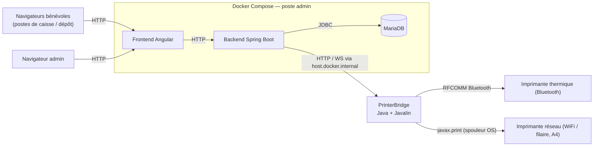
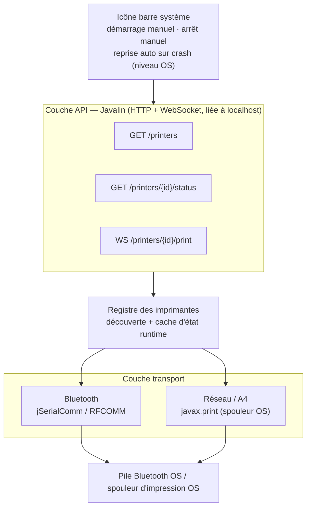

# CLAUDE.md — PrinterBridge

## Présentation

PrinterBridge est un petit service natif, installé sur le poste de l'admin d'une association utilisant **PluriBourse** (plateforme de gestion de bourses aux jouets/vêtements, dépôt `PluriBourse` — repo séparé). Son rôle : posséder seul l'accès aux imprimantes physiques (Bluetooth, WiFi, filaire) et les exposer via une petite API locale, pour que le backend de PluriBourse n'ait plus jamais à parler directement au matériel.

Ce document résume les décisions et pistes issues d'une session de conception avec l'utilisateur (juillet 2026) — c'est un **point de départ pour cadrer le travail**, pas une spec figée. Beaucoup de détails restent à trancher (voir § Points ouverts).

## Pourquoi ce projet existe

PluriBourse tourne en **Docker Compose** sur le poste de l'admin (backend Spring Boot + frontend Angular + MariaDB, dans des conteneurs). Deux problèmes structurels en ont découlé :

1. **Le Bluetooth n'est pas accessible depuis un conteneur.** Les imprimantes thermiques utilisées pour les étiquettes de dépôt se connectent en **Bluetooth RFCOMM (profil SPP)** — un périphérique matériel de la machine hôte, pas une ressource réseau. Un conteneur Docker n'y a par défaut aucun accès, y compris sous Docker natif Linux (la cible principale des associations — voir § Positionnement) : le passthrough Bluetooth vers un conteneur reste non trivial (permissions, règles udev), même si techniquement moins bloqué que sous Docker Desktop Windows/Mac.
2. **Une imprimante Bluetooth n'accepte qu'une connexion active à la fois** (contrainte du protocole SPP, pas de l'implémentation). Pour qu'elle soit partagée entre plusieurs postes de caisse/dépôt, il faut qu'**un seul processus** détienne la connexion physique et serve les autres postes par-dessus — d'où l'intérêt d'un point central.

PrinterBridge est ce point central : un processus natif (donc avec accès plein au matériel de l'hôte), qui tourne à côté du conteneur backend, et que le backend interroge via HTTP/WebSocket au lieu d'ouvrir lui-même des sockets/ports série.

Les imprimantes réseau (WiFi/filaire, type A4) n'ont pas ce problème d'accès matériel — un conteneur Docker les joint très bien via son réseau bridge par défaut. Elles passent quand même par PrinterBridge pour centraliser la logique de découverte/statut au même endroit, et parce qu'une association peut aussi rencontrer des soucis de segmentation réseau (VLAN d'entreprise, etc.) indépendants de Docker.

## Ce qui a été écarté, et pourquoi

- **`javax.print` côté backend** — ne fonctionnerait que si le backend tournait nativement sur une machine avec les imprimantes déjà installées au niveau OS ; inutilisable depuis un conteneur Docker minimal (pas de CUPS/spouleur configuré dedans). Ce rejet ne concerne que l'exécution **dans le conteneur** — PrinterBridge, qui tourne nativement sur l'hôte, utilise justement `javax.print` pour les imprimantes réseau/A4 (voir § Stack technique retenue).
- **QZ Tray** (agent d'impression open source existant, https://qz.io) — sérieusement envisagé, c'est un outil mature qui fait déjà à peu près ce rôle (Serial/USB/Socket, ESC/POS, API WebSocket locale/distante). Écarté au profit d'un développement maison pour garder le contrôle total du contrat d'API et éviter une dépendance externe — **à rediscuter si le scope de PrinterBridge grossit trop** (ex. support USB/HID, imprimantes exotiques).
- **Sortir tout le backend de Docker** — réglerait aussi le problème Bluetooth, mais casserait la simplicité d'installation (`docker compose up`) documentée pour un public non technique. Écarté pour l'instant ; reste une option si PrinterBridge s'avère trop complexe à maintenir.
- **Faire relancer PrinterBridge par le backend en cas de crash** — impossible proprement : le backend tourne dans un conteneur isolé du système hôte, il n'a aucun moyen sain de lancer un processus natif sur la machine hôte (sans donner au conteneur des privilèges larges, ce qui casserait l'isolation qu'on cherche à garder).

## Positionnement et hypothèses de déploiement (v1)

- **Correction (juillet 2026, après-coup)** : la cible principale du poste admin est en réalité **Linux (Debian/Ubuntu, x86_64 — poste de bureau, ex. avec KDE)**, pas Docker Desktop Windows/Mac comme supposé initialement dans la session de conception. Une cible secondaire Raspberry Pi/Raspbian (arm64/armhf) est aussi envisagée, à supporter mais moins prioritaire. Les sections ci-dessus mentionnant Windows/Mac comme cible principale restent affichées telles quelles (traces de la session initiale) mais sont **obsolètes sur ce point précis** — se fier à cette section pour la réalité du déploiement.
- PrinterBridge tourne sur **la même machine physique** que le backend Dockerisé de PluriBourse, pour l'instant. Pas encore pensé pour un scénario multi-machines.
- Le backend (dans son conteneur) joint PrinterBridge en HTTP via `host.docker.internal`. Sur la cible principale (Docker natif Linux), ça **nécessite** `extra_hosts: - "host.docker.internal:host-gateway"` côté `docker-compose.yml` de PluriBourse — ce n'est plus un cas secondaire, c'est la configuration standard attendue. Windows/Mac Docker Desktop (si jamais rencontré chez une association) l'a nativement, sans configuration supplémentaire.
- **Lancement manuel par l'admin**, pas de démarrage automatique à l'ouverture de session/boot — choix produit assumé (voir échange avec l'utilisateur : préférence pour une appli visible et contrôlée plutôt qu'un service invisible qui tourne toujours). Une icône en barre système est prévue pour que l'admin voie que ça tourne.
- **Reprise automatique en cas de plantage, oui** — via le mécanisme natif de l'OS (Recovery d'un Service Windows, `Restart=on-failure` d'une unité systemd, `KeepAlive` d'un LaunchAgent macOS), pas de code applicatif custom pour ça. Ce réglage est indépendant du démarrage automatique : on peut avoir l'un sans l'autre.
- Le backend PluriBourse doit dans tous les cas détecter et **afficher clairement** quand PrinterBridge est injoignable (message visible, pas un badge discret) — c'est le vrai filet de sécurité, peu importe les choix ci-dessus.

## Stack technique retenue

- **Java**, empaqueté avec **`jpackage`** — génère un installeur natif par OS (**.deb Linux/Debian/Ubuntu — cible principale**, .msi Windows, .pkg Mac, ces deux derniers secondaires) qui embarque son propre runtime minimal. `jpackage` invoque `jlink` en interne (pas d'invocation manuelle) pour construire ce runtime par analyse `jdeps` de l'app. **Aucun JDK à installer côté admin.** Voir § Décisions prises (paquetage multi-OS) pour le pipeline Maven qui prépare l'entrée de `jpackage`.
- **Javalin** comme framework HTTP/WebSocket — un microframework (une seule dépendance obligatoire, Jetty embarqué), beaucoup plus léger que Spring Boot pour ce besoin (2-3 endpoints). Nécessite Java 17+.
- **jSerialComm** pour l'accès Bluetooth (RFCOMM) — la même bibliothèque déjà utilisée côté backend PluriBourse (`SerialPort.getCommPorts()` / `getCommPort(...).openPort()`), donc du code et un savoir-faire directement réutilisables.
- **`javax.print`** (API Java standard) pour la découverte *et* l'impression des imprimantes réseau/A4 — interroge et pilote le spouleur déjà configuré au niveau OS (spouleur Windows, CUPS sur Mac/Linux). L'admin ajoute l'imprimante via les réglages OS habituels ; PrinterBridge liste ce que l'OS connaît déjà (`PrintServiceLookup`) et soumet les jobs via `DocPrintJob`, sans gérer lui-même de socket ni de port 9100 — le driver du fabricant s'occupe de la livraison réseau/USB/VLAN.
  ⚠️ **Limite constatée en pratique (test sur machine réelle)** : le spouleur Windows ne supporte **aucun** flavor PDF natif (`DocFlavor.INPUT_STREAM.PDF` non supporté par les 3 imprimantes testées, y compris "Microsoft Print to PDF") — contrairement à CUPS (Mac/Linux), nativement centré PDF. Seuls les flavors image (GIF/JPEG/PNG), `Pageable`/`Printable` (pipeline Java2D) et `application/octet-stream` générique sont supportés côté Windows. **`Apache PDFBox`** est donc utilisé pour rendre chaque page du PDF reçu en image, encapsulée dans un `java.awt.print.Printable`, soumis via `DocFlavor.SERVICE_FORMATTED.PRINTABLE` — ce flavor-là est supporté partout. Reste dans l'esprit de la décision initiale (tout via `javax.print`), avec ce détour de rendu ajouté.

## Architecture logicielle

### Vue d'ensemble (contexte système)

### Architecture interne de PrinterBridge

### Responsabilités par couche

- **Registre / découverte** — énumère les ports Bluetooth appairés (`jSerialComm.getCommPorts()`) et les imprimantes réseau/A4 déjà installées au niveau OS (`javax.print.PrintServiceLookup`). Pas de scan actif dans les deux cas : l'admin appaire/ajoute l'imprimante via les réglages OS habituels, PrinterBridge se contente de lister ce qui existe déjà.
- **Identifiants stables** — chaque imprimante reçoit un id déterministe dérivé de son adresse physique (hash du descripteur de port Bluetooth — MAC si `jSerialComm` l'expose, sinon le nom de port système ; hash du nom du `PrintService` OS pour le réseau/A4). Recalculé au démarrage, pas de fichier d'état à persister. PluriBourse ne connaît que cet id, jamais l'adresse physique.
- **Transport Bluetooth** — ouvre/écrit sur le port RFCOMM. Une seule connexion active à la fois par imprimante (contrainte du protocole).
- **Transport réseau / A4** — délègue au spouleur d'impression de l'OS via `javax.print` (`PrintServiceLookup` pour la découverte, `DocPrintJob` pour l'envoi) ; le driver du fabricant gère la livraison réseau/USB/VLAN à la place de PrinterBridge.
- **Couche API** — HTTP + WebSocket, **liée à `localhost` uniquement**, jamais exposée publiquement (elle accepte des jobs d'impression, donc surface sensible).

## API exposée au backend PluriBourse (provisoire)

| Méthode | Chemin | Rôle |
|---|---|---|
| `GET` | `/printers` | Liste des imprimantes découvertes + statut courant — alimente le formulaire admin de PluriBourse (fin de la saisie manuelle IP/port). |
| `GET` | `/printers/{id}/status` | Test de connectivité à la demande. |
| `WS` | `/printers/{id}/print` | Envoi du contenu à imprimer (bytes ESC/POS pour le thermique, PDF pour l'A4). |

**Tranché :** l'enveloppe de `WS /printers/{id}/print` est un petit message JSON de contrôle (type de contenu, taille) suivi d'une frame binaire brute portant le payload (bytes ESC/POS ou PDF). Identifiants stables : voir § Responsabilités par couche (id dérivé de l'adresse physique, pas de nom choisi par l'admin côté PrinterBridge).

**Reste non tranché :** gestion des erreurs/timeouts remontées au backend.

## Ce que ça change côté PluriBourse (repo séparé)

Pour référence — ce travail n'est **pas** dans ce repo, mais dans `PluriBourse` :

- `Printer` (entité JPA) et sa migration — repenser ce qu'on stocke : aujourd'hui `host`/`port` (A4) ou `serialPort`/`widthMm` (THERMAL) correspondent à un accès direct ; avec PrinterBridge, PluriBourse n'a plus besoin de connaître l'adresse physique, juste un identifiant stable côté PrinterBridge.
- `PrinterConnectivityChecker` (interface + impls `NetworkPrinterConnectivityChecker`/`SerialPrinterConnectivityChecker`) — remplacées par un client HTTP vers `GET /printers/{id}/status`.
- `ThermalPrintService`/`DocumentPrintService` — au lieu d'écrire directement sur `Socket`/`SerialPort`, envoient le contenu via `WS /printers/{id}/print`. C'est aussi l'occasion de découpler le **format de contenu** (ESC/POS vs PDF) du **transport** — aujourd'hui couplés en dur par le type d'imprimante (`PrinterType.THERMAL`/`A4`), alors qu'avec PrinterBridge n'importe quel format pourrait voyager sur n'importe quel transport (ex. imprimante thermique WiFi, pas supportée aujourd'hui).
- `docker-compose.yml` de PluriBourse — ajout de `extra_hosts` pour la compatibilité Linux.
- Frontend (`printer-form.component.ts`) — remplace la saisie manuelle host/port par une liste issue de `GET /printers`.

Cette conversation de conception a aussi produit un schéma visuel (artefact Claude) — non repris ici car privé/éphémère ; ce document en est la version texte durable.

## Décisions prises (session juillet 2026 bis)

- **Découverte réseau/A4** — pas de scan de sous-réseau ni mDNS : PrinterBridge liste les imprimantes déjà installées au niveau OS via `javax.print`. Le job d'impression est aussi soumis via `javax.print` (`DocPrintJob`), qui remplace entièrement le socket TCP brut et le port 9100 évoqués initialement.
- **Format d'échange** sur `WS /printers/{id}/print` — JSON de contrôle (type de contenu, taille) + frame binaire brute pour le payload.
- **Identifiants d'imprimante** — id déterministe dérivé de l'adresse physique (voir § Responsabilités par couche), pas de fichier d'état persisté, pas de nom choisi par l'admin côté PrinterBridge.
- **Signature de code** — pas de certificat en v1 pilote ; avertissements SmartScreen/Gatekeeper assumés, à documenter pour l'admin (procédure "exécuter quand même").

## Décisions prises (implémentation découverte réseau/A4 et Bluetooth)

- **Spike jSerialComm confirmé** — l'API ne donne accès à aucune adresse MAC Bluetooth ni identifiant matériel stable pour un port SPP (seulement `getSerialNumber()`/VID/PID pour de l'USB, inapplicable au Bluetooth). L'id est donc dérivé de `getSystemPortName()` (ex. `COM7`). Limite connue : si l'OS réattribue un port COM différent au même appareil réappairé, l'id changera — accepté comme compromis, cohérent avec l'absence de fichier d'état à persister.
- **`jSerialComm.getCommPorts()` n'a aucun moyen fiable de distinguer un port Bluetooth SPP d'un autre port série (USB, UART physique)** — la découverte Bluetooth actuelle liste donc tous les ports COM détectés comme candidats thermiques. À affiner une fois testé contre une vraie imprimante thermique appairée (aucun matériel Bluetooth disponible pour valider un filtre pour l'instant).
- **Registre** (`PrinterRegistry`) — agrège une `List<PrinterDiscovery>` (`BluetoothPrinterDiscovery`, `NetworkPrinterDiscovery`), exposé tel quel par `GET /printers`. `PrinterDiscovery` (interface : `discover()`, `findById(id)`) a été introduite pour deux raisons : permettre un faux déterministe en test (les deux implémentations réelles dépendent de l'OS/du matériel, donc les tests actuels ne peuvent que constater ce qui existe sur la machine), et parce qu'une 3e implémentation (WiFi thermique, cf. Points ouverts) est plausible. Les méthodes propres à chaque transport (`findPort`/`findService`, utilisées par `PrintJobService` pour récupérer le handle bas niveau) restent hors interface, chaque transport ayant un type de handle différent (`SerialPort` vs `PrintService`).
  `PrinterRegistry` est lui-même instanciable (constructeur par défaut = les deux implémentations réelles ; constructeur avec `List<PrinterDiscovery>` pour l'injection). `ApiServer` en garde une seule instance statique. Un `FakePrinterDiscovery` (test uniquement) permet de tester l'agrégation et le fallback de `findStatus` de façon déterministe, sans dépendre de ce qui est installé sur la machine qui exécute les tests.
- **`WS /printers/{id}/print` implémenté** (`PrintJobService`) — message JSON de contrôle (`contentType`, `size`) puis frame binaire, conforme à la décision de format. Bluetooth accepte uniquement `ESC_POS` (écriture directe sur le port RFCOMM ouvert/fermé pour l'occasion) ; réseau/A4 accepte uniquement `PDF` (rendu via PDFBox, voir § Stack technique). Un mismatch contenu/transport (ex. PDF vers Bluetooth) est rejeté explicitement plutôt que silencieusement accepté — le découplage total contenu/transport évoqué plus haut reste une piste future, pas fait en v1.
- **Tests** : les chemins d'erreur (id inconnu, mismatch de type de contenu, taille déclarée incorrecte, payload binaire sans message de contrôle) sont couverts automatiquement. **Volontairement non testé automatiquement** : une impression réussie de bout en bout — risque réel de déclencher une boîte de dialogue (Microsoft Print to PDF) ou d'imprimer sur un vrai copieur réseau si un test tournait sur une machine avec des imprimantes installées. À valider manuellement, avec prudence, quand le besoin s'en fait sentir.

## Décisions prises (paquetage multi-OS via jpackage)

- **Pipeline Maven** (`pom.xml`, phase `package`) : `maven-jar-plugin` produit le jar exécutable (`Main-Class` + attribut manifeste `Enable-Native-Access: ALL-UNNAMED`, cf. décision jSerialComm/JEP 472 plus haut) ; `maven-dependency-plugin` (`copy-dependencies`, `includeScope=runtime`) copie toutes les dépendances runtime **à plat** dans `target/jpackage-input` ; `maven-resources-plugin` y copie aussi le jar principal. Résultat : un seul dossier `target/jpackage-input` contenant le jar + toutes ses dépendances, prêt pour `jpackage --input`.
- **Pas de `jlink` manuel** — contrairement à la formulation initiale ("`jpackage` + `jlink`"), `jpackage` invoque `jlink` **en interne** et construit automatiquement un runtime minimal par analyse `jdeps` de l'app, sans configuration `--add-modules` manuelle. Aucune de nos dépendances n'étant modularisée (pas de `module-info`), un `jlink` manuel serait de toute façon impossible (jlink ne sait pas empaqueter des modules automatiques).
- **Classpath construit automatiquement par `jpackage`** — tous les jars présents dans `--input` (à plat, pas en sous-dossier) sont ajoutés au classpath du lancement généré ; pas besoin d'un jar "fat"/shaded ni d'un attribut `Class-Path` dans le manifeste. Vérifié dans `PrinterBridge.cfg` généré.
- **Vérifié de bout en bout sur cette machine (Windows)** : `jpackage --type app-image` construit un `.exe` fonctionnel ; lancé manuellement, `GET /printers` répond correctement avec les imprimantes réelles de la machine.
- **`--type msi` ne fonctionne pas sur cette machine** — nécessite le **WiX Toolset v3** (`light.exe`/`candle.exe` sur le PATH), absent ici. C'est une dépendance d'environnement normale, pas un bug : le runner `windows-latest` de GitHub Actions l'a préinstallé, ce qui est probablement là où ce script tournera réellement en CI.
- **Linux (`.deb`) est la cible principale** (cf. § Positionnement) — `packaging/jpackage-linux.sh` (`--type deb`) génère un `.deb` compatible Debian/Ubuntu. **Non testé** : aucune machine Linux disponible dans l'environnement de dev (Windows) au moment de l'écriture — à valider avant usage réel. `--linux-deb-maintainer` contient un placeholder (`TODO@example.org`) à remplacer par une vraie adresse de contact avant publication.
- **jpackage ne fait pas de cross-compilation** — un `.deb` construit sur/pour x86_64 ne s'installera pas sur un Raspberry Pi (arm64/armhf), et inversement. La cible arm64 (Raspberry Pi/Raspbian, secondaire) demandera un runner ou une machine de build arm64 dédiée le moment venu — le script `jpackage-linux.sh` fonctionne tel quel sur les deux architectures, seule la machine qui l'exécute change.
- **Scripts** : `packaging/jpackage-windows.ps1` (`--type msi`, testé jusqu'au point de blocage WiX), `packaging/jpackage-macos.sh` (`--type pkg`, **non testé**), `packaging/jpackage-linux.sh` (`--type deb`, **non testé**). Les trois lisent la version depuis `pom.xml` et la nettoient du suffixe `-SNAPSHOT` pour `--app-version` (qui exige un numérique strict `X.Y.Z`).

## Points ouverts (à trancher avant/pendant la story)

1. **CI multi-OS** — les scripts jpackage existent (Windows, Mac, Linux) mais ne sont pas encore branchés sur un pipeline CI (GitHub Actions ?). Linux (x86_64) est la cible principale à valider en premier ; Mac et arm64 (Raspberry Pi) restent complètement non testés faute de machine disponible.
2. **Compatibilité de contrat d'API entre les deux repos** — PluriBourse et PrinterBridge évoluent maintenant séparément ; proposition : versionnage dans l'URL (`/v1/printers`, etc.), à valider et instrumenter (tests de contrat) quand un premier changement cassant se présentera.
3. **Découverte imprimante WiFi thermique** — toujours reportée. Contrairement au réseau/A4 (résolu via `javax.print`), une imprimante thermique WiFi utilise typiquement un protocole ESC/POS brut sur socket (pas le spouleur OS) — nécessiterait sa propre couche transport (proche de l'actuel Bluetooth mais en TCP) et le découplage contenu/transport côté PluriBourse déjà noté plus haut.

## Conventions proposées (à ajuster librement — projet neuf)

Reprises de PluriBourse par cohérence (même auteur), à confirmer :
- Code en anglais (variables, méthodes, classes) ; commentaires/JavaDoc en anglais ; documentation de projet en français.
- Types explicites, pas de `var`.
- Accolades obligatoires sur tous les blocs `if`/`else`/`for`/`while`, même sur une ligne.
- Commentaires uniquement quand le *pourquoi* n'est pas évident depuis le code.
- Tests orientés bout-en-bout plutôt qu'unitaires isolés quand c'est pertinent — s'inspirer du double de test déjà utilisé côté PluriBourse pour l'A4 (un `ServerSocket` local ouvert dans les tests plutôt qu'une vraie imprimante réseau) pour tester la couche transport sans matériel réel. Le chemin Bluetooth réel, lui, n'est testé par aucun automatisme côté PluriBourse (pas de matériel disponible en CI) — probablement la même limite ici.
- Logique métier (découverte, agrégation...) regroupée dans un package `service` (`org.printerbridge.service`), à la manière Spring Boot — convention volontairement reprise même si Javalin ne l'impose pas, par préférence explicite de l'utilisateur. Les classes de modèle/domaine (`Printer`, `PrinterType`, `PrinterStatus`, `PrinterId`) restent dans `org.printerbridge.printer`.
